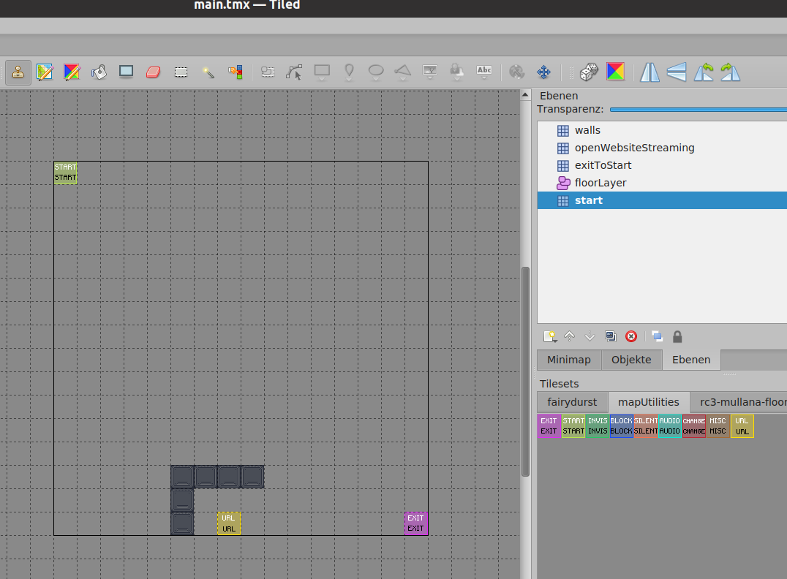

See [HowTo rC3 world maps](https://howto.rc3.world/maps.html).

This map is available under the following testserver URL: [link](https://test.visit.at.wa-test.rc3.cccv.de/_/global/elektroglitzer.github.io/rc3map/main.json).

Currently a minimal example with basic map layers:

# TODO / Wish List
## Basic
- [ ] floor
- [ ] walls

## Common
- [ ] panorama window (with view into the space)
- [ ] coffee machine
- [ ] television
- [ ] sofa
- [ ] pony statue
- [ ] stairs
- [ ] sleeping bag
- [ ] bed
- [ ] dining table
- [ ] table
- [ ] easy chair
- [ ] toilette
- [ ] washbasin

## ne-mo
- [ ] table
- [x] deskmat
- [x] laptop
- [x] monitor
- [x] Filco
- [ ] Maja
- [x] Redox
- [x] Coffee cup
- [ ] Mate
- [x] soldering iron
- [x] trackball
- [ ] PCB
- [ ] office chair
- [ ] lava lamp
- [ ] lamp
