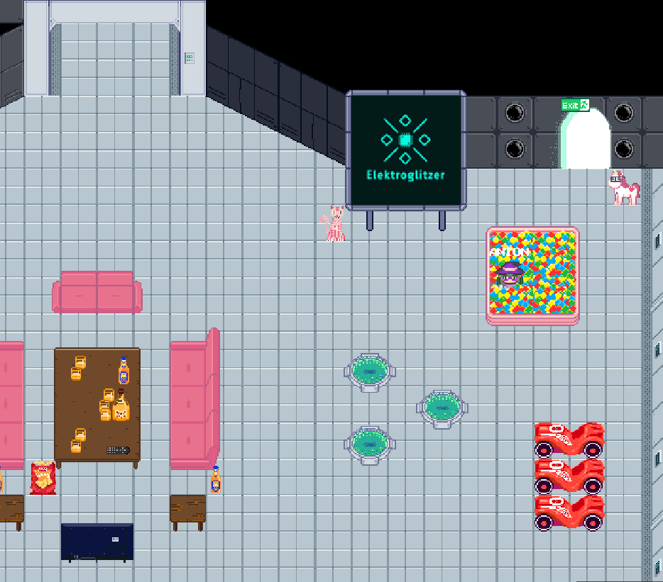

# rC3 world map for elektroglitzer assembly

See [HowTo rC3 world maps](https://howto.rc3.world/maps.html).

This map is available under the following testserver URL: [link](https://test.visit.at.wa-test.rc3.cccv.de/_/global/elektroglitzer.github.io/rc3map/main.json).

Currently a minimal example with basic map layers:

## TODO RC3 - 2021

* Add badges and object layers for them
    * e.g. see old carBadge, washBadge, printBadge, entryBade layers
* Add big blue button link

## TODO / Wish List

### Basic
- [ ] floor
- [ ] walls

### Common
- [ ] panorama window (with view into the space)
- [ ] coffee machine
- [ ] television
- [ ] sofa
- [ ] pony statue
- [ ] stairs
- [ ] sleeping bag
- [ ] bed
- [ ] dining table
- [ ] table
- [ ] easy chair
- [ ] toilette
- [ ] washbasin

### ne-mo
- [ ] table
- [x] deskmat
- [x] laptop
- [x] monitor
- [x] Filco
- [ ] Maja
- [x] Redox
- [x] Coffee cup
- [ ] Mate
- [x] soldering iron
- [x] trackball
- [ ] PCB
- [ ] office chair
- [ ] lava lamp
- [ ] lamp

## How to test locally

Its possible to preview the changes on a local instance before pushing them to the repo. Please be aware that the offical rC3 test instance uses another docker images, so it might behave differently.

1. Clone the [workadventure repo](https://github.com/thecodingmachine/workadventure)
2. Edit the docker-compose.yaml and change the [volume mapping](https://github.com/thecodingmachine/workadventure/blob/7bbfa16ca2a1452b859065835a0e3edde11b65ae/docker-compose.yaml#L86) to point to the local folder where this repo is checked out
3. Start the docker images `docker-compose up -d` in the workadventure repo
4. The map is available then under the following URL: [http://play.workadventure.localhost/_/global/maps.workadventure.localhost/main.json](http://play.workadventure.localhost/_/global/maps.workadventure.localhost/main.json)
